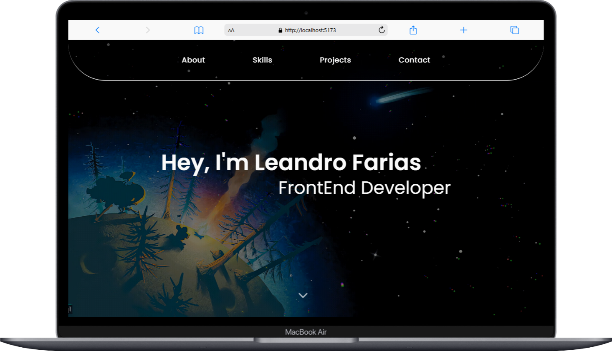

<h1 align="center">Portfolio Pessoal 🚀</h1>

<h2>📜 Descrição do Projeto </h2>

Bem-vindo ao meu Portfolio Pessoal! 
Este projeto foi desenvolvido para apresentar minhas habilidades como desenvolvedor web e destacar os projetos que já realizei. Utilizando as tecnologias mais recentes e animações modernas, meu objetivo é proporcionar uma experiência visual agradável, dinâmica e responsiva. O portfolio está sempre em evolução, e continuarei atualizando-o à medida que aprendo novas ferramentas e aprimoro minhas competências.

### ✨ **Destaques do Portfolio**

- **Design Atraente e Personalizado**: Um layout moderno e visualmente impactante que reflete minha personalidade e meu progresso como desenvolvedor.
- **Animações Dinâmicas com Framer Motion**: Utilizei a biblioteca Framer Motion para adicionar animações suaves e interativas, proporcionando uma experiência mais imersiva aos usuários.
- **Responsividade com CSS**: O site foi projetado para oferecer uma experiência perfeita em dispositivos móveis, tablets e desktops, garantindo acessibilidade em todos os tamanhos de tela.
- **Seção de Projetos**: Uma vitrine que destaca meus principais projetos, com detalhes sobre cada um, as tecnologias utilizadas e links para repositórios e demos.

---

### 🚀 **Tecnologias Utilizadas**

    
    
    
    

---

### 📸 **Preview do Portfolio**

